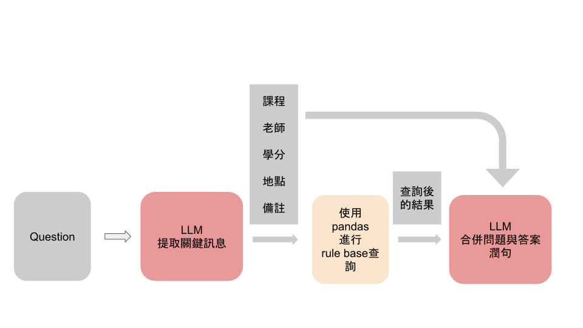

# 選課無地雷 LLM 系統

## 專案簡介
本專案旨在透過 **Ollama** 自行架設一個大型語言模型 (LLM)，為學生提供精準的電機系課程查詢服務。我們採用了基於規則的方式 (Rule-Based System) 來確保答案的準確性，並結合 LLM 提供更加自然的語言回應和關鍵詞提取。

專案中的功能包括：
- 支援學生查詢特定課程的詳細資訊，例如上課時間、授課教授、課程學分數等。
- 透過預先定義的規則篩選問題，保證答案的格式及準確性。
- 記錄每次查詢的過程，方便後續分析與優化。

> 與常見的 Retrieval-Augmented Generation (RAG) 不同，本系統完全採用基於規則的精確匹配方式，避免模糊搜尋的可能誤差。



---

## 功能特色
1. **語意解析與格式檢查**  
   根據學生輸入的問題，解析並提取關鍵字，進一步匹配已定義的規則。
2. **記錄與分析**  
   每次查詢的輸入與輸出皆被記錄到 CSV 文件中，用於後續的查詢行為分析。
3. **規則檢查與自訂模版**  
   為各類查詢定義了詳細的回應模版，並設計自訂的規則檢查流程以確保正確性。
4. **拼音搜尋**  
   將中文關鍵字轉換為拼音，避免同音不同字導致搜尋不到相關課程或者教授的問題。
5. **語言優化**  
   結合 LLM 提供語句增強功能，生成更自然的回應。

---

## 專案結構
```
├── main.py                # 主程式碼，包含問題解析與查詢邏輯
├── webui.py               # 調用main.py的web介面
├── llama_custom/          # 自訂 LLM 的模組 (語意分析、語句增強等)
├── log.csv                # 用於記錄查詢過程的日誌文件
├── requirements.txt       # 所需的 Python 套件列表
└── README.md              # 專案說明文件
```

---

## 環境設置
1. 建議使用 Conda 來安裝 Python
```bash
conda create -n llm python=3.8
conda activate llm
```
2. 安裝必要的套件：
   ```bash
   pip install -r requirements.txt
   ```
3. 配置 Ollama 模型(建議在Ubuntu上運行，如果已經安裝過可以直接跳到模型安裝)  
    安裝Ollama
    ```bash
    curl -fsSL https://ollama.com/install.sh | sh
    ```
    安裝模型(建議顯存 > 8GB以上)
    ```bash
    ollama run wangshenzhi/llama3-8b-chinese-chat-ollama-q8 
    ```
    安裝模型(顯存 < 8GB)
    ```bash
    ollama run wangshenzhi/llama3-8b-chinese-chat-ollama-q4
    ```

4. 安裝完成後，透過ollama serve來啟動服務
    ```bash
    ollama serve
    ```
    保持服務運行，並在`llama_custom.py`中設定ollama的模型種類(默認為上方提到的8B模型)

5. * 啟動main.py(則一)
    ```bash
    python main.py
    ```
    * 啟動web介面(則一)
    ```bash
    python webui.py
    # ->啟動 127.0.0.1:8000 來訪問網頁
    ```

6. 開始使用查詢服務！

---


## 貢獻
歡迎提交 Pull Request，協助改進本專案！
